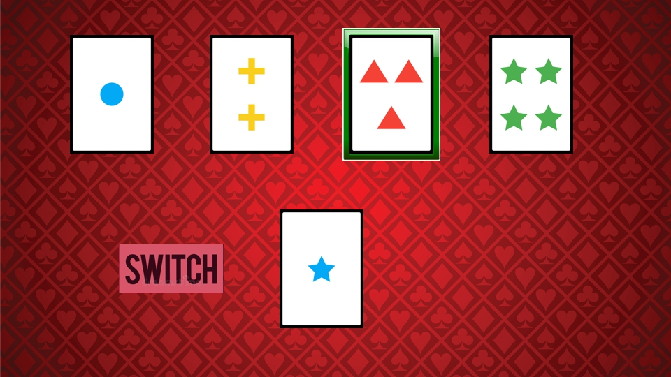
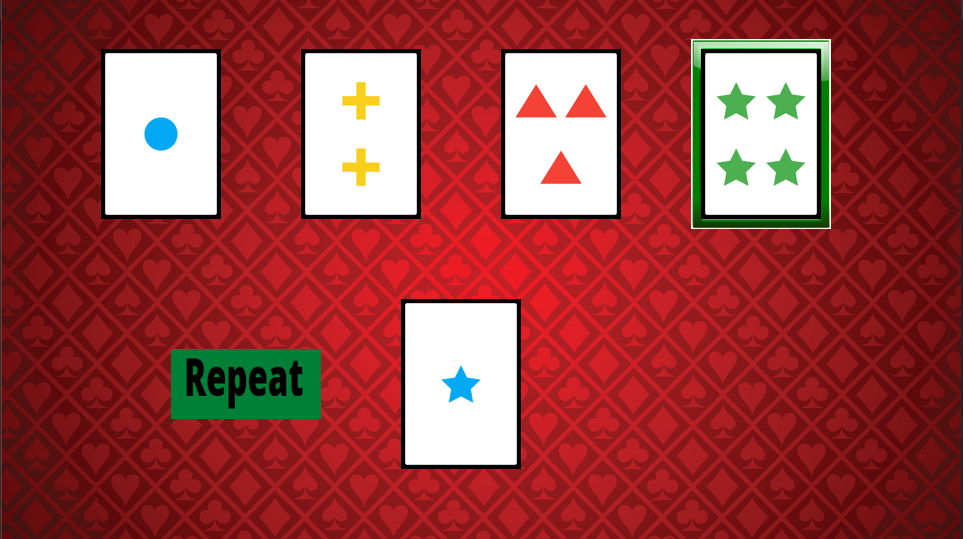

# Reinforced Foxes’ NMA 2021 DL Project 🦊

We have implemented the Wisconsin Card Sorting Task (WCST) environment using [OpenAI-Gym](https://gym.openai.com/).

<!--  -->
<!--  -->

We have created a vanilla Q-learning agent with a memory of the last rule and the current reward-streak.\
We are now going to create a deep-Q-net that will play with the same environment.

